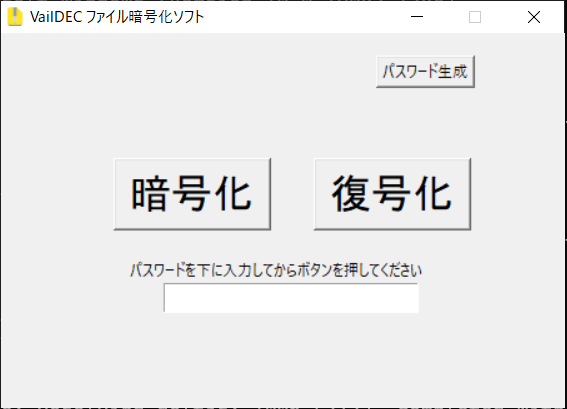

File Encrypt Software
このリポジトリはLinux版のソースコード用です。
<a href="https://github.com/Vail-Zero/VailDEC3-sources">Windows版リポジトリ</a>
<h1>VailDEC3-sources</h1>

このソフトウェアは簡単に使用できることを目標に制作された操作が簡単なファイル暗号化ソフトウェアです。

フリーソフトウェアとして配布され、ソースコード自体も BSD 3-Clause Licenseにてここでオープンソース化しております。

Linuxバージョンは正式版を公開していません

<h2>screenshot</h2>

本ソフトウェアでファイルに設定したパスワードを忘れた場合、作者でも解読は不可能です。
 
※本ソフトウェアで暗号化したファイルは同じVailDEC3でのみ復号化が可能です。

VailDEC3内で使っている別作者によるライブラリは、それぞれのライセンスに従ってください

VailDEC3はライブラリなどの環境を整えれば、どのプラットフォームでも動かすことができます。 
このリポジトリ内のVailDEC3はLinuxで確認済み 
(画面の解像度によってレイアウトが崩れる場合があります。) 
